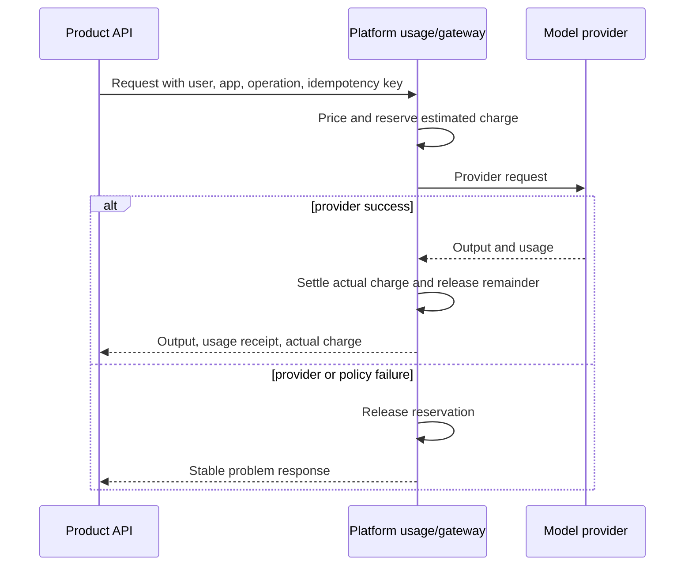

# Application integration contract

## Purpose

An iweioo application remains independently deployable while participating in
single sign-on, usage controls, privacy workflows, observability, and the
cross-product account experience.

The contract is implemented through `iweioo-sdk` for Python and TypeScript.
The SDK is a convenience layer; the OpenAPI and event schemas remain the source
of truth.

## Application identity

Every application receives:

- a stable lowercase `app_id`, for example `interview` or `defense`;
- registered public and internal base URLs;
- an OIDC web client with exact redirect URIs;
- one or more service accounts with least-privilege scopes;
- an event source URI;
- a data classification and lifecycle declaration;
- owned health, metrics, and support endpoints.

Credentials are environment-specific and never committed.

Each product also submits a manifest conforming to
[`contracts/applications/application-manifest.schema.json`](../../contracts/applications/application-manifest.schema.json).
The checked-in interview and defense manifests remain `planned` until their
onboarding gates pass; a manifest never contains credentials or an
environment-specific private service address. Deployment configuration
combines the registered internal base URL with `lifecycle_callback_path`.

## Required integration sequence

1. Redirect unauthenticated users to the central OIDC authorization endpoint.
2. Complete Authorization Code plus PKCE in the server-side BFF.
3. Store only an opaque host-only application session in the browser.
4. Validate audience-scoped tokens in the product API.
5. Create an idempotent local projection keyed by `platform_user_id`.
6. Check entitlement or credit before a billable action.
7. Use the LLM gateway for model calls so routing, price version, usage, and
   fallback are recorded centrally.
8. Emit only registered, sanitized activity and growth events.
9. Implement product export and deletion callbacks.
10. Expose health, metrics, version, and dependency readiness.

## API rules

- Public contracts use versioned URLs such as `/v1`.
- Breaking changes require a new major contract version and a migration window.
- Writes that can be retried require `Idempotency-Key`.
- Requests propagate W3C `traceparent` and a platform request ID.
- Errors use `application/problem+json` with a stable machine-readable type.
- Pagination is cursor based for unbounded lists.
- Timeouts, retry eligibility, and rate-limit headers are explicit.
- Unknown JSON response fields must be ignored by clients.
- Secrets, tokens, raw prompts, and sensitive content are not logged.

## Usage lifecycle

The preferred LLM path is a single gateway call that performs reservation and
settlement internally. The generic hold API exists for other billable work.

Products never calculate authoritative balance. A displayed estimate includes
its pricing version and expires. Usage receipts contain provider quantity,
provider cost, charged amount, model route, and correlation ID.

## Event delivery

Each service writes an outbox event in the same transaction as its business
change. A relay publishes to Redis Streams. Consumers acknowledge only after a
durable idempotent write.

Delivery is at least once. Consumers deduplicate by event ID and tolerate
reordering across subjects. An event is immutable; corrections are new events.
Dead-letter entries preserve the safe envelope and failure metadata without
copying sensitive payloads.

Initial event families:

- `iweioo.identity.user.created.v1`
- `iweioo.application.activity.recorded.v1`
- `iweioo.growth.observation.recorded.v1`
- `iweioo.usage.settled.v1`
- `iweioo.privacy.deletion.requested.v1`

## Product data lifecycle callback

The platform issues a signed, idempotent lifecycle job to the owning product.
The product reports `accepted`, `running`, `completed`, or `failed` and attaches
counts by storage class. A deletion is complete only when the product database,
objects, vectors, caches, and queued derived work have been addressed.

## Onboarding gate

An application cannot appear in the production app catalog until it has:

- passing contract, unit, integration, and end-to-end tests;
- an ownership and data-flow document;
- a threat model and abuse limits;
- usage budget and pricing behavior;
- export and deletion evidence;
- backup and restore evidence;
- health, metrics, alerts, and an incident runbook;
- a staging deployment and rollback record.
