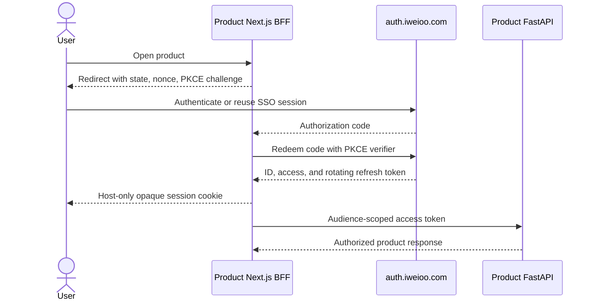

# Identity and access

## Decision

Keycloak is the initial identity provider at `auth.iweioo.com`. Applications
integrate through OpenID Connect rather than Keycloak-specific adapters where a
standards-compliant framework library is available.

This decision replaces the interview application's custom phone-code token and
adds identity to the thesis-defense application. Existing development users do
not require migration.

## User authentication

The first login method is email and password with mandatory first-email
verification and password recovery. Phone and social login are outside the
first release.

Each web application uses OpenID Connect Authorization Code flow with PKCE
`S256`, exact redirect URI matching, `state`, and `nonce`. Implicit flow and the
resource-owner password grant are disabled.

## Browser session rules

- Refresh and access tokens are held by the server-side BFF, not browser local
  storage.
- Every subdomain uses its own host-only `HttpOnly`, `Secure`, `SameSite=Lax`
  opaque session cookie.
- No authentication cookie is scoped to `.iweioo.com`.
- Single sign-on occurs through the identity-provider session and a short
  redirect, not by sharing application cookies.
- Session identifiers rotate after login and privilege changes.
- Logout revokes the local session and the identity-provider grant.

## Token rules

- Access tokens are short lived and restricted by issuer, audience, scope, and
  authorized party.
- Product APIs validate signature, allowed algorithm, issuer, audience,
  expiration, not-before time, and required scopes against cached JWKS.
- Refresh tokens rotate and replay causes the token family to be revoked.
- User-delegated cross-service calls use token exchange or a separately issued
  audience token; unsigned identity headers are forbidden.
- Background workers use service accounts with least-privilege scopes and an
  explicit subject reference where a user-owned record is affected.
- Keys rotate with overlapping verification windows and an exercised runbook.

## Global user identity

The OIDC `sub` issued by the iweioo realm is the stable global subject for the
first release. Platform and product tables store it as a UUID named
`platform_user_id`. The platform also keeps an identity-link record containing
issuer and subject so a future identity-provider migration can be performed
without rewriting product history.

No product creates a shadow user from an arbitrary request header. A first
authenticated request may create an idempotent local user projection from a
validated token.

## Authorization

Authentication and authorization are separate. Keycloak provides identity and
coarse scopes; each service enforces ownership and business authorization.

Initial roles:

- `user`
- `support_agent`
- `content_operator`
- `auditor`
- `platform_admin`

Administrative roles require MFA and private-network access. A role never
bypasses row ownership checks unless a documented, audited support operation
explicitly grants that access.

## Required controls

- password policy and breached-password screening where the configured
  provider supports it;
- email verification token expiry and one-time use;
- login, registration, recovery, and verification rate limits;
- brute-force detection and progressive lockout;
- session list and remote revocation for the user;
- mandatory MFA for privileged accounts;
- login and privilege-change audit events;
- no production development codes or default credentials.

## Standards references

- [OpenID Connect Core 1.0](https://openid.net/specs/openid-connect-core-1_0-18.html)
- [OAuth 2.0 Security Best Current Practice](https://www.rfc-editor.org/rfc/rfc9700.html)
- [Keycloak application security overview](https://www.keycloak.org/securing-apps/overview)
- [Keycloak container production guidance](https://www.keycloak.org/server/containers)
