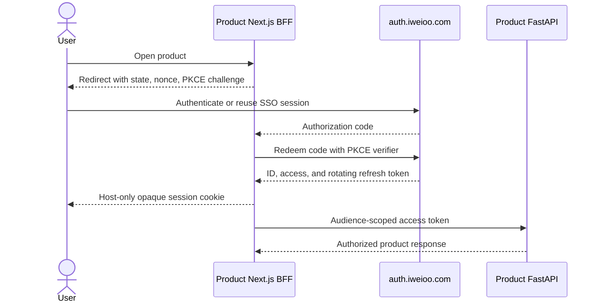

# Identity and access

## Decision

Keycloak is the initial identity provider at `auth.iweioo.com`. Applications
integrate through OpenID Connect rather than Keycloak-specific adapters where a
standards-compliant framework library is available.

This decision replaces the interview application's custom phone-code token and
adds identity to the thesis-defense application. Existing development users do
not require migration.

## User authentication

The first login method is email and password with mandatory first-email
verification and password recovery. Phone and social login are outside the
first release.

Each web application uses OpenID Connect Authorization Code flow with PKCE
`S256`, exact redirect URI matching, `state`, and `nonce`. Implicit flow and the
resource-owner password grant are disabled.

## Browser session rules

- Refresh and access tokens are held by the server-side BFF, not browser local
  storage.
- Every subdomain uses its own host-only `HttpOnly`, `Secure`, `SameSite=Lax`
  opaque session cookie.
- No authentication cookie is scoped to `.iweioo.com`.
- Single sign-on occurs through the identity-provider session and a short
  redirect, not by sharing application cookies.
- Session identifiers rotate after login and privilege changes.
- Logout revokes the local session and the identity-provider grant.
- A shared Redis user index contains only random public session IDs and safe
  device/application metadata. Cookie handles, record locators, raw User-Agent,
  IP address, and tokens are excluded.
- Session listing and revocation are bound to the verified global subject and
  require same-origin, session-bound CSRF validation for mutations.

## Token rules

- Access tokens are short lived and restricted by issuer, audience, scope, and
  authorized party.
- Product APIs validate signature, allowed algorithm, issuer, audience,
  expiration, not-before time, and required scopes against cached JWKS.
- Refresh tokens rotate and replay causes the token family to be revoked.
- User-delegated cross-service calls use token exchange or a separately issued
  audience token; unsigned identity headers are forbidden.
- Background workers use service accounts with least-privilege scopes and an
  explicit subject reference where a user-owned record is affected.
- Keys rotate with overlapping verification windows and an exercised runbook.

## Global user identity

The OIDC `sub` issued by the iweioo realm is the stable global subject for the
first release. Platform and product tables store it as a UUID named
`platform_user_id`. The platform also keeps an identity-link record containing
issuer and subject so a future identity-provider migration can be performed
without rewriting product history.

No product creates a shadow user from an arbitrary request header. A first
authenticated request may create an idempotent local user projection from a
validated token.

## Authorization

Authentication and authorization are separate. Keycloak provides identity and
coarse scopes; each service enforces ownership and business authorization.

Initial roles:

- `user`
- `support_agent`
- `content_operator`
- `auditor`
- `platform_admin`

Administrative roles require MFA and private-network access. A role never
bypasses row ownership checks unless a documented, audited support operation
explicitly grants that access.

## Required controls

- password policy and breached-password screening where the configured
  provider supports it;
- email verification token expiry and one-time use;
- login, registration, recovery, and verification rate limits;
- brute-force detection and progressive lockout;
- session list and remote revocation for the user;
- mandatory MFA for privileged accounts;
- login and privilege-change audit events;
- no production development codes or default credentials.

## Local implementation baseline

The Stage 2 development profile lives under `deploy/keycloak` and
`deploy/compose/identity.compose.yml`. It imports a secret-free realm into a
dedicated local PostgreSQL database, routes email to Mailpit, and provides a
password-protected, non-persistent Redis instance for BFF state. All published
ports bind to loopback; database and SMTP ports remain private.

The imported Web clients are confidential BFF clients, require Authorization
Code plus PKCE `S256`, use one exact callback URI, disable implicit and direct
password grants, and receive an audience restricted to their client ID. No
client secret or privileged user is committed. A bearer-only Platform API
client supplies the API audience; the Account access token includes that
audience in addition to its own client audience.

The portal and account center use the same server-only `@iweioo/auth-bff`
implementation at `/auth/login`, `/auth/register`, `/auth/callback`,
`/api/auth/session`, and POST-only `/auth/logout`. The account client also owns
`/api/auth/sessions`, per-session DELETE routes, and POST-only
`/auth/logout-all`. They remain separate clients
and processes. OIDC transaction records are one-time and expire after ten
minutes. Access, refresh, and ID tokens stay in app-scoped Redis namespaces;
each browser host receives only its own random opaque session handle. Sessions
default to the 30-minute realm idle window and are further bounded by the
refresh-token lifetime. The session API returns an explicit token-free DTO, and
logout requires both an exact same-origin request and a session-bound CSRF token
before local deletion, token revocation, and RP-initiated logout.

Each v2 BFF session also has an unrelated random public session ID. All iweioo
BFF applications use the same protected Redis database for a subject-scoped
index while keeping token records app-scoped. The index is capped atomically,
expires with the sessions, and stores only application ID, coarse device/OS,
creation, and expiry. Locator records are separate from safe metadata. The
account center can revoke one indexed session or all indexed BFF sessions.
Logout-all additionally performs normal Keycloak RP logout for the current
browser; without a privileged Keycloak Admin credential, it does not forcibly
delete another device's underlying Keycloak browser SSO cookie. That device's
iweioo BFF sessions are still invalidated.

Local development uses `iweioo_portal_*` and `iweioo_account_*` cookie names
because cookies are scoped by host, not port. Production uses host-only
`__Host-iweioo_*` cookies independently on each HTTPS subdomain; no parent-domain
cookie is introduced. A local end-to-end smoke confirmed that authenticating
once at the portal let the account client reuse the Keycloak SSO session while
creating a separate BFF session for the same verified `sub`.

The account BFF uses its server-side session token to call the Platform API and
refreshes short-lived access tokens under an app-scoped Redis lock. Browser
mutations require same-origin fetch metadata and JSON bodies; tokens never enter
browser storage or responses.

The v2 Redis record is intentionally incompatible with the earlier local-only
record. Before production, rollout clears the non-persistent development Redis
and users sign in again. A future production migration must drain or explicitly
expire old sessions rather than silently accepting unindexed records.

The Platform API accepts only RS256 access tokens with the configured issuer,
`iweioo-platform-api` audience, `iweioo-account` authorized party, expiry,
required scopes, verified email, and UUID subject. It creates the user
projection idempotently, binds all profile/consent operations to that subject,
and records consent evidence and privacy-safe audit metadata in PostgreSQL.
Missing consent evidence means not granted. A grant is valid only for the
currently registered policy version.

This profile is evidence for local contract development only. `start-dev`,
Mailpit, loopback Redis publishing, localhost redirect URIs, and bootstrap
administration are prohibited in staging and production. See the
[local identity runbook](../../deploy/keycloak/README.md).

## Standards references

- [OpenID Connect Core 1.0](https://openid.net/specs/openid-connect-core-1_0-18.html)
- [OAuth 2.0 Security Best Current Practice](https://www.rfc-editor.org/rfc/rfc9700.html)
- [Keycloak application security overview](https://www.keycloak.org/securing-apps/overview)
- [Keycloak container production guidance](https://www.keycloak.org/server/containers)
