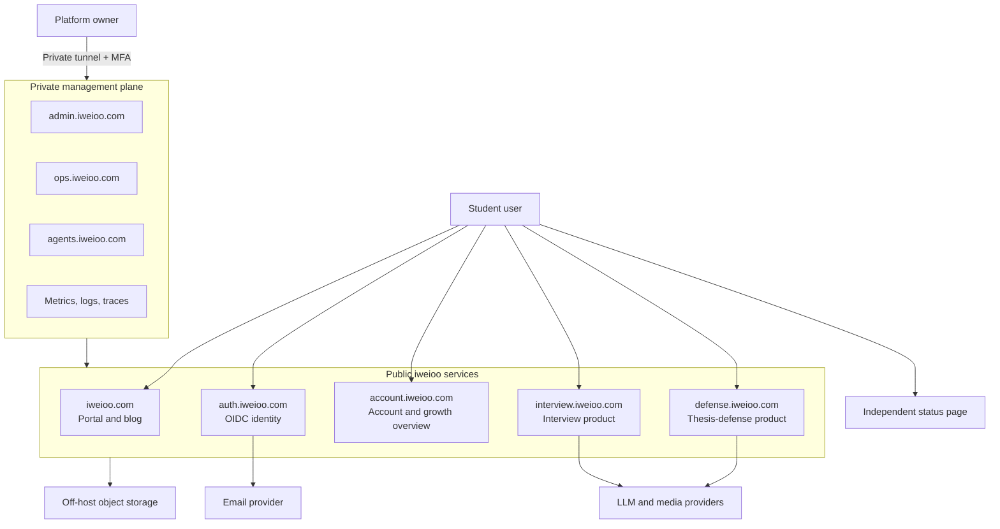

# System architecture

## Architectural style

`iweioo-platform` is a modular platform service, not a collection of premature
microservices. The two products remain independently deployable applications.
This preserves their existing code and release histories while centralizing
only capabilities that must be consistent across products.

The initial deployment uses Docker Compose on one Tencent Cloud Linux server.
Logical service, database, credential, and network boundaries remain in place
so a later move to multiple nodes does not require changing public contracts.

## System context

## Runtime components

| Component | Responsibility | Initial form |
| --- | --- | --- |
| Edge proxy | TLS, host routing, request limits, security headers | One container |
| Platform web | Portal, blog, account BFF, public legal pages | Next.js |
| Identity provider | Registration, email verification, passwords, SSO, MFA | Keycloak |
| Platform API | Profiles, consent, app registry, credits, usage, growth summaries | FastAPI modular monolith |
| Platform worker | Outbox relay, email work, export/deletion workflows | Python worker |
| Interview product | Interview-specific UI, API, worker, and data | Existing repository |
| Defense product | Defense-specific UI, API, worker, RAG, and data | Existing repository |
| LLM gateway | Provider routing, pricing, budgets, holds, settlement, evaluation hooks | Platform module with worker boundary |
| PostgreSQL | Durable relational state | One cluster, separate databases and roles |
| Redis | Cache, rate limits, jobs, and Redis Streams | One instance, ACL and namespace isolation |
| Qdrant | Product vector collections | One instance, collection isolation |
| Object storage | Uploads, generated assets, backups, exports | Tencent COS or compatible service |
| Observability | Prometheus metrics, structured logs, traces, alert routing | Private services |

## Network and trust zones

Only TCP 80 and 443 are public. SSH is restricted to administrative source
paths and key authentication. Database, Redis, Qdrant, metrics, dashboards,
Keycloak administration, and agent administration are private.

The login endpoints at `auth.iweioo.com` are public. Keycloak administration
uses a separate private route and is not exposed through the public proxy.

Service-to-service traffic uses a private container network. An application
does not become trusted merely because it is on that network: it still presents
an audience-restricted service or delegated user token.

## Database topology

One PostgreSQL cluster contains separate databases and credentials:

- `keycloak`
- `iweioo_platform`
- `interview`
- `thesis_defense`
- later agent databases

There are no cross-database foreign keys or cross-service table reads. Redis
uses ACL users and prefixes per service. Qdrant uses separate collections and
service credentials where supported.

## Evolution path

When load or reliability evidence requires it, components can move in this
order without changing user-facing URLs:

1. move backups and user objects off host;
2. move workers to a separate compute node;
3. move PostgreSQL to a managed or dedicated node;
4. add redundant application nodes behind a load balancer;
5. enable the existing Kubernetes deployment adapter;
6. add regional deployments with explicit data residency boundaries.

The launch profile targets RPO 1 hour and RTO 4 hours. It has a documented
single point of failure and does not claim automatic failover.
